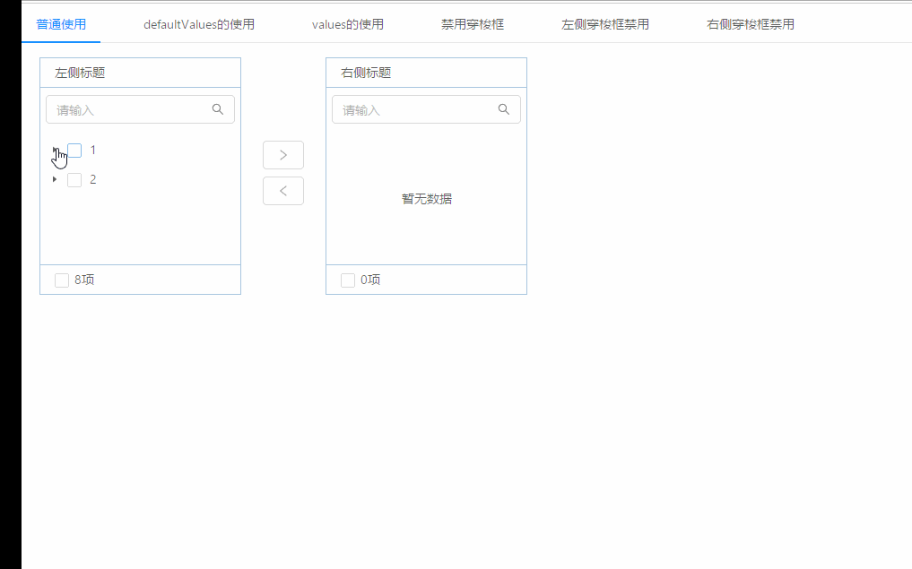

## 基于antd的tree组件实现treeTransfer组件
> tree形式的穿梭框支持左右tree形式的数据展示

**[vue + element版本](https://github.com/dyxweb/vueTreeTransfer)**

**API**

| api | 类型 | 是否必选 | 默认值 | 说明 |
| --- | --- | --- | --- | --- |
| dataSource | array | true | [] | 完整的数据源遵循Tree的数据结构 |
| title | array | true | - | 穿梭框的标题（数组第一项为左侧，第二项为右侧）|
| defaultValues | array | false | [] | 默认的初始值只在组件第一次渲染时生效 |
| values | array | false | [] | 受控选择的values |
| disabled | boolean | false | false | 是否禁用 | 
| leftDisabled | boolean | false | false | 左侧Tree是否禁用 | 
| rightDisabled | boolean | false | false | 右侧Tree是否禁用 | 
| showSearch | boolean | false | true | 是否有搜索框 |
| searchItems | array | false | ['label', 'key'] | 搜索时匹配的属性（数据源的属性要与此同步）|
| searchPlaceholder | array | false | ['请输入', '请输入'] | 搜索框的placeHolder |
| notFoundContent | string | false | 暂无数据 | 无数据时的显示文本 |
| onMove | function | false | - | 数据移动时触发的函数， 默认参数一为选择的keys，参数二为数组形式的JSON字符串数据为为选择之后左侧的数据源和右侧的数据源 |

**示例**


**简单使用**
```
const mockData = [
  {
    "title": '1',
    "key": "1",
    "children": [
      {
        "title": "1-0",
        "key": "1-0",
        "children": [
            {
              "title": "1-0-0",
              "key": "1-0-0"
            },
            {
              "title": "1-0-1",
              "key": "1-0-1"
            },
        ],
      },
      {
        "title": "1-1",
        "key": "1-1",
        "children": [
          {
            "title": "1-1-0",
            "key": "1-1-0"
          },
          {
            "title": "1-1-1",
            "key": "1-1-1"
          },
        ],
      }
    ],
  },
  {
    "title": '2',
    "key": "2",
    "children": [
      {
        "title": "2-0",
        "key": "2-0",
        "children": [
          {
            "title": "2-0-0",
            "key": "2-0-0"
          },
          {
            "title": "2-0-1",
            "key": "2-0-1"
          }
        ],
      },
      {
        "title": "2-1",
        "key": "2-1",
        "children": [
          {
            "title": "2-1-0",
            "key": "2-1-0"
          },
          {
            "title": "2-1-1",
            "key": "2-1-1"
          }
        ],
      },
    ],
  }
];

onMove = (keys, info) => {
  console.log(keys);
  console.log(JSON.parse(info));
}

<TreeTransfer
  dataSource={mockData}
  title={['左侧标题', '右侧标题']}
  onMove={this.onMove}
/>
```
